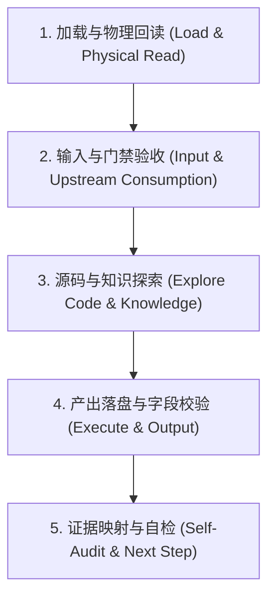

# Hermes Harness Engine (驾驭与审计引擎)

## 1. 核心定位
本引擎是 Hermes Agent 工作流的“驾驭层 (Harness)”，负责定义全局 5 阶段工作流、阶段内部 5 步循环规程，以及统一的安全门禁、反幻觉与硬证据对账审计规范。

---

## 2. 全局 5 阶段工作流 (Standard 5-Stage Workflow)

所有开发任务必须遵循以下 5 阶段流程流转。在没有生成或更新当前阶段的标准产物前，禁止向后流转：

1. **Stage 1: 需求与设计 (Requirement & Design)**
   - **目标**：将模糊需求与项目现状结合，确立系统设计、架构决策与约束。
   - **产出**：`.workflow/design-contract.md`
2. **Stage 2: 任务拆分 (Task Planning)**
   - **目标**：将设计契约细化为具备 AC-id 的最小原子任务 TODO 清单。
   - **产出**：`.workflow/task-list.md`
3. **Stage 3: 编码实现 (Implementation)**
   - **目标**：在 Task List 约束内编写代码，记录详细的物理修改文件。
   - **产出**：`.workflow/walkthrough.md`
4. **Stage 4: 审查与验证 (Review & Verification)**
   - **目标**：**脱水审查**，运行测试套件，捕获并绑定真实的命令行执行 Trace。
   - **产出**：`.workflow/review-report.md`
5. **Stage 5: 复盘与自进化 (Retro & Evolution)**
   - **目标**：复盘流程问题，沉淀项目本地认知，将复用模式编译为物理 `SKILL.md`。
   - **产出**：`.workflow/retro-evolution.md`

---

## 3. 阶段内部 Hermes 5 步循环规程 (5-Step Phase Loop)

每个阶段内部的执行过程必须按以下固定顺序运行，**绝对禁止打乱或跳步**：

1. **加载与物理回读 (Load & Physical Read)**：物理读取当前入口列出的核心规则、协议及上游产物，在 `Evidence Ledger` 登记 `E-id`。
2. **输入与门禁验收 (Input & Upstream Consumption)**：检查上游交付。在产物的 `Upstream Consumption` 章节对上游所有结构化项（如 `AC-id`, `M-id`, `T-id` 等）逐条标注状态为 `Consumed / Not Applicable / Deferred`。**Upstream Reference Rate 必须 100%**。
3. **源码与知识探索 (Explore Code & Knowledge)**：执行 codegraph 查询和知识库 INDEX 读取，确认代码符号与已有约束。
4. **产出落盘与字段校验 (Execute & Output)**：将阶段产物保存到 `.workflow/<artifact>.md`，**必须 100% 完整包含且仅包含对应模板的二级标题**，绝对不允许裁剪标题。不适用的必须保留标题并写 `Not Applicable`。
5. **证据映射与自检 (Self-Audit & Next Step)**：自检断言真实性。将所有完成性断言写入 `Claim Evidence Map`，挂载真实的 `E-id` 证据。核对无误后，给出下一步或回退建议。

---

## 4. 驾驭层硬门禁与审计规范 (Harness Gates)

### Input Gate (输入门禁)
- 缺少当前阶段必需的上游产物物理文件时，禁止进入。
- 进入任何阶段，必须物理读取 `C:\knowledge\INDEX.md` 与项目本地的架构索引（如 `docs/architecture/INDEX.md` 或等价入口），并登记在 Evidence Ledger。
- **模板章节硬锁**：任何产物被发现漏掉/合并模板标题均判定为违规并打回。

### Scope Gate (阶段边界隔离)
- 每个阶段只做本阶段的职责：需求设计阶段禁写实现代码与拆任务；任务拆分阶段禁写实现代码；复盘自进化阶段禁改写业务代码。

### Evidence Gate & Anti-Hallucination (证据与反幻觉审计)
以下任一行为均被判定为“伪证据”导致审计失败：
1. **记忆冒充证据**：声称已读/已调用但 `Evidence Ledger` 中无对应条目。
2. **字段模糊缺失**：`Type`（Read / Tool Call / Command / Response）、`Tool or Command`（具体工具名）、`Target`（精确路径/符号）或 `Result`（行号区间如 `L10-L30`、具体输出、状态码）任何一个留空或使用“已读 / OK”等模糊词。
3. **失败宣称完成**：工具失败（`Result=Failed: <error>`）或返回非零退出码时，仍宣称“已验证/无问题”。失败仅能标记结论为 `Blocked / Not verified / Pending`，并登记在 `Blockers`。
4. **逻辑思考造假**：使用 `sequential-thinking` 思考层时，`Logic Thinking Evidence` 必须至少贴出**首尾 Thought** 的 `thoughtNumber`、`totalThoughts` 及 `nextThoughtNeeded`，且 `totalThoughts` 必须 $\ge 5$。
5. **未映射绑定**：在 Claim Evidence Map 之外或未挂真实 E-id 的完成断言一律无效。

### Challenge & Rollback Gate (质疑与回退门禁)
- 后续阶段开始前，必须对上游产物进行**完整性、可执行性、一致性、简化空间**的质疑。
- 质疑不通过必须严格打回。回退时必须输出：`回退目标阶段`、`回退原因`、`支撑证据 E-ids` 和`上游需补充内容`。

### Review Gate (执行 Trace 审查硬锁)
- **审查阶段 (Stage 4) 专属硬锁**：拒绝一切纯文本口头证明。
- 审查报告必须在验证章节贴出**测试命令在终端运行的 stdout/stderr 的真实 Trace 日志**。没有捕获到真实测试执行成功 Trace 的提交，直接判定为审查不通过。
