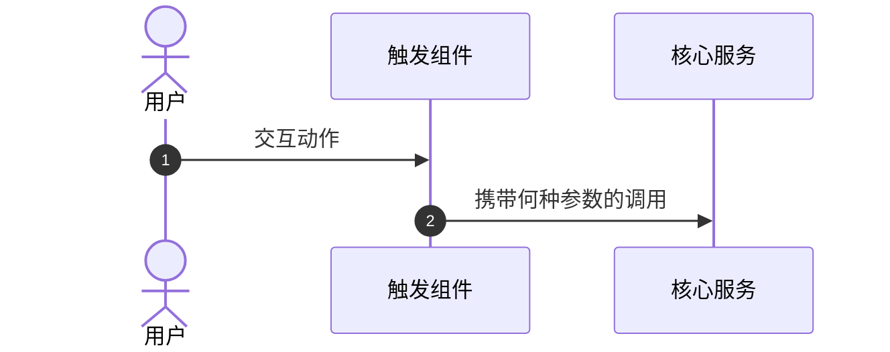

# [模块名称] 子系统架构与链路

## 1. 架构总览 (Architecture Overview)
- **设计模式/原则**: (如单向数据流、网关制等)
- **核心角色定义**: 
  - `组件/服务A`: 职责描述，暴露的接口/状态。
  - `组件/服务B`: 职责描述，暴露的接口/状态。

## 2. 核心链路 (Core Workflows)
### 2.1 [关键链路名]
> **设计背景**: (描述痛点或为什么要采用此链路)

## 3. 架构约束与演进原则 (Maintenance Rules)
1. **关键避坑点**: (列出哪些写法是被绝对禁止的，例如：严禁在此处写死状态、禁止直接绕过某服务直接发请求等)
2. **拓展指南**: (后续若在此模块增加新功能，标准的操作范式是什么)
